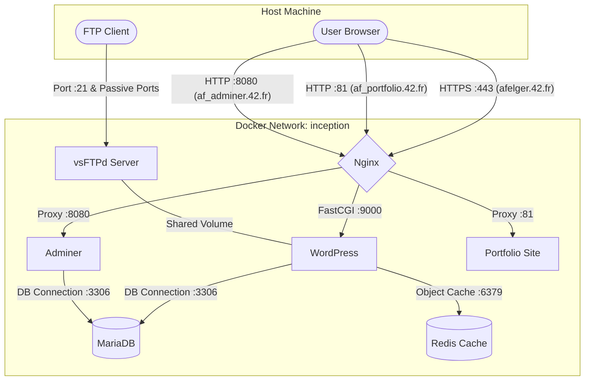

_This project has been created as part of the 42 curriculum by afelger_

# Description

This is a web stack running in docker containers. It includes Nginx, MariaDB, Adminer, WordPress, Redis, FTP, and a static site. All of the services are connected to each other using docker networks and volumes.

## Architecture Diagram



# Instructions

Makefile targets and description

```bash
make
# will run the setup, build and run process

make build
# will run the build process for all services

make run
# will run the services in detached mode

make stop
# will stop the services

make clean
# will remove the build marker

make re
# will remove the build marker and run the build process
```

helpful docker commands

```bash
docker ps
# list all running containers

docker ps -a
# list all containers

docker logs <container_name>
# view logs of a container

docker logs -f <container_name>
# follow logs of a container

docker exec -it <container_name> <command>
# execute a command in a container

docker network ls
# list all networks

docker network inspect <network_name>
# inspect a network

docker volume ls
# list all volumes

docker volume inspect <volume_name>
# inspect a volume

docker stats
# show resource usage of all containers

docker stats --no-stream
# show resource usage of all containers without streaming

docker system prune
# remove all stopped containers, networks, images and build cache

docker system prune -a
# remove all stopped containers, networks, images and build cache

docker system prune -a -f
# remove all stopped containers, networks, images and build cache without confirmation
```

# Ressources

## Docker

## Nginx

[NGINX Beginners Guide](https://nginx.org/en/docs/beginners_guide.html)

## Wordpress

## MariaDB

[MariaDB Documentation](https://mariadb.org/documentation/)
[Example MariaDB Dockerfile](https://github.com/docker-library/mariadb/blob/master/10.11/Dockerfile)
[Short Example MariaDB Dockerfile](https://github.com/federico-razzoli/docker-mariadb-alpine/blob/master/Dockerfile)
[Replacing the default host](https://serverfault.com/questions/584607/changing-the-mysql-bind-address-within-a-script)

## Redis

[Redis Documentation](https://redis.io/documentation/)
[Example Redis Dockerfile](https://github.com/redis/docker-library-redis/blob/master/7.4/debian/Dockerfile)

## Adminer

[Adminer Website](https://www.adminer.org/en/)
[Setup Guide](https://serverpilot.io/docs/guides/apps/adminer/)

## FTP

[vsFTPd Quickstart Ubuntu](https://wiki.ubuntuusers.de/vsftpd/)
[vsFTPd conf reference](https://linux.die.net/man/5/vsftpd.conf)

## Static

[Markdown Website Generator in python by me](https://github.com/K0M15/MWG)
